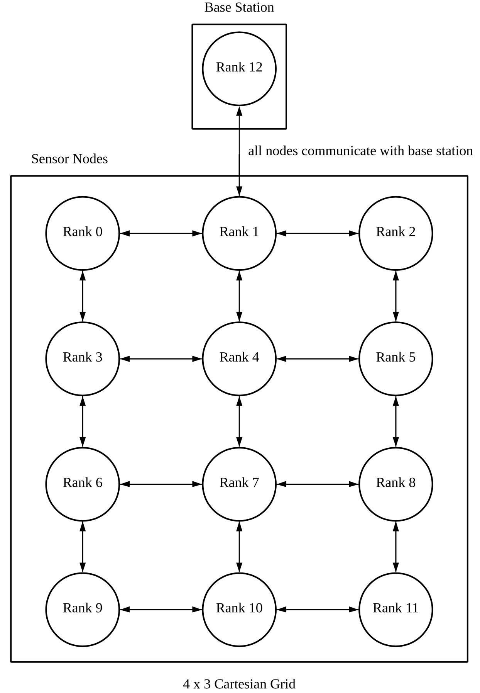
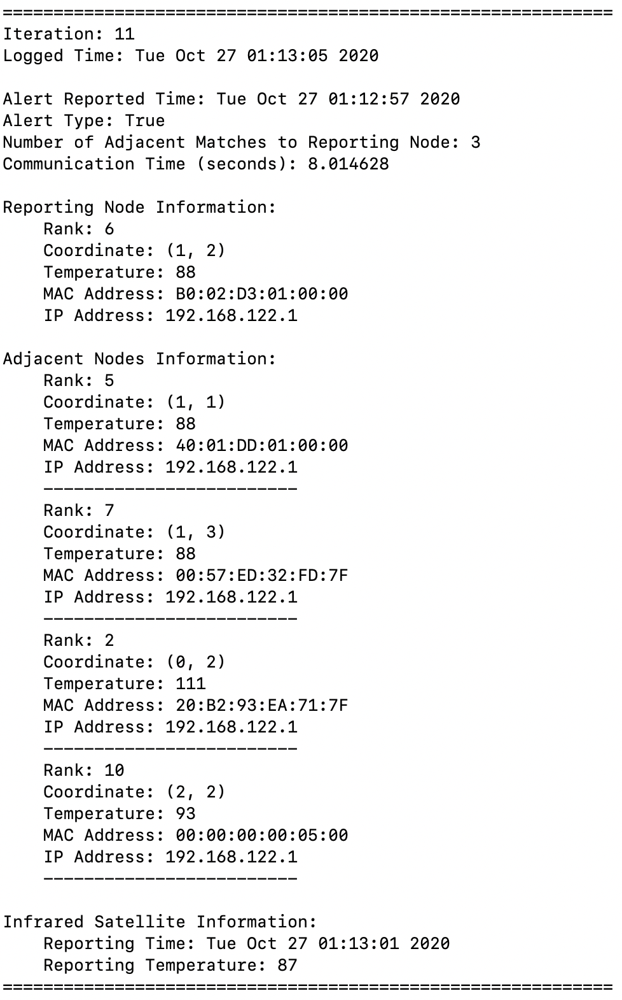
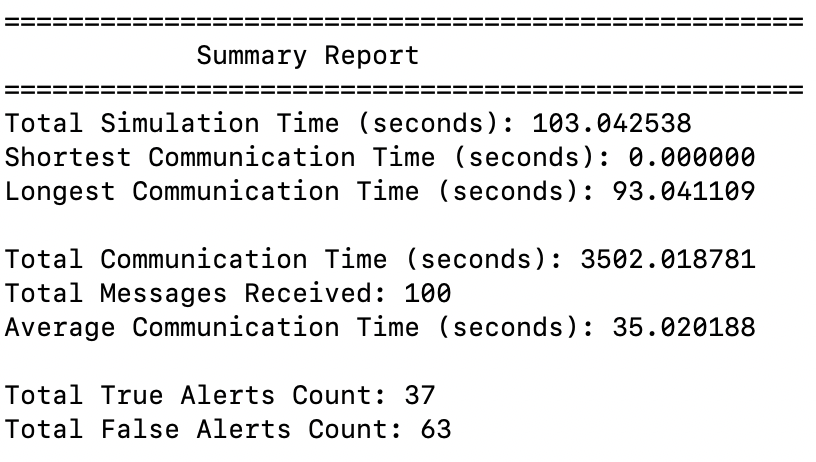

# Preface
An alert detection of a distributed [wireless sensor network](https://en.wikipedia.org/wiki/Wireless_sensor_network) with the use of [Open MPI](https://www.open-mpi.org). 

Cartesian grid is used as the topology to simulate the communication between the sensor nodes and base station with the following design scheme: 

    

These sensor nodes communicate directly with its neighbouring nodes and the base station. The base station then constructs a thread at the start to simulate the infrared imaging satellite that periodically generates the temperature readings of the sensor nodes. 

The temperatures are then used by the bsae station to compare with the report received by the grond sensor sensor nodes to determine if an open burning forest is on-going and produces a log report of the technical details.

A sample of the log generated is as follow: 

    

A summary of the alert detection is also generated: 

    

## How to run

1. Download the files
2. `cd` into `src/` directory
3. Run `make` to produce compiled executable files
4. Run `make [run-small | run-med | run-large]` to run different sizes of cartesian grid detections 
5. Read the report log generated! 😃

